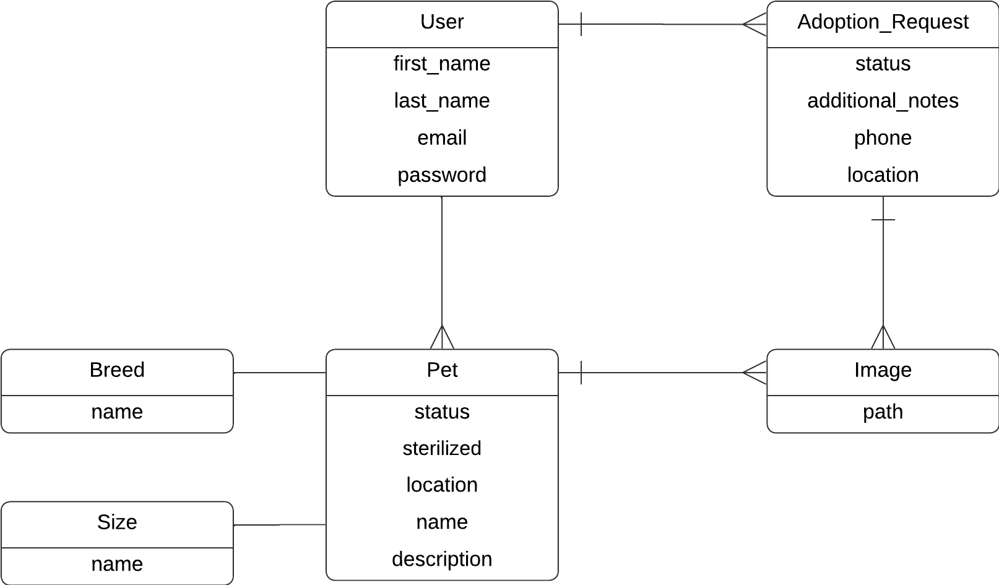

# Huellitas Cochalas

**Equipo:** Bit Buddies  
**Materia:** Programación Web  
**Descripción del Proyecto:** Aplicación para la adopción de animales

## Diagrama ER




## comando para habilitar las imagenes
```sh
php artisan storage:link
```


## Comandos Docker
Para construir las imágenes de los servicios, utiliza:

```sh
docker-compose build
```

Para levantar los servicios con Docker Compose, utiliza el siguiente comando:

```sh
docker-compose up -d
```

Para detener los servicios, utiliza:

```sh
docker-compose down
```

Para acceder a un contenedor en ejecución y abrir una terminal bash, utiliza:

```sh
docker-compose exec -it huellitas-backend /bin/bash
```

## Descripción

Huellitas Cochalas es una aplicación web diseñada para facilitar la adopción de animales. La plataforma permite a los usuarios visualizar y buscar animales disponibles para adopción, y a los centros de rescate y cuidadores publicar animales en busca de un hogar. La app está desarrollada para ser intuitiva, fácil de usar y accesible desde dispositivos móviles y de escritorio.

## Tecnologías Utilizadas

- **Frontend:** React, Material-UI
- **Backend:** Django
- **Base de Datos:** Postgresql